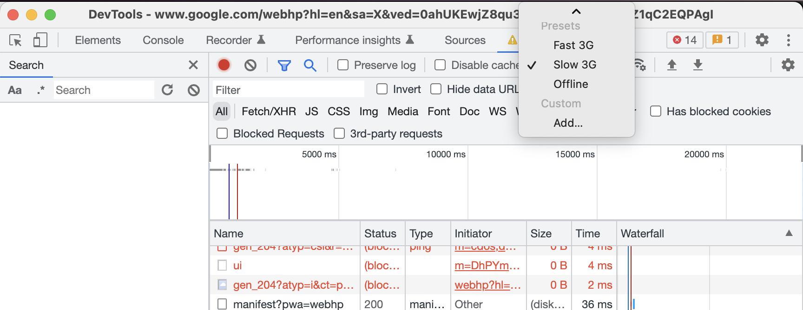

# Triple Axle's Frontend Take Home

Hello, candidate! Excited to have ya this far in the pipeline. I'm always available for questions at `christian at tripleaxle dot com`!

There are two parts to this take home. A little bit of CLI and repository organization and then implementing 3 pages.

## Part 1: Initializing the Repo

Using Node latest LTS (v16) and [yarn](https://yarnpkg.com/),

- stand up a *TypeScript* *React* [Next.js](https://nextjs.org/docs) repository using any method you prefer

- make sure that your `.gitignore` file includes everything from your initializer along with what is found at https://github.com/github/gitignore/blob/main/Node.gitignore

- install [Tailwind CSS](https://tailwindcss.com/) using [PostCSS](https://postcss.org/) as a preprocessor

- using Next.js pages
  - add [Open Graph](https://ogp.me/) and HTML meta tags to your `_document.tsx` so that I can see a preview of your work using https://www.opengraph.xyz/
  - design two components to be used in a parent `Page` component:
    - header (more to come below)
    - footer
      - feel free to choose any format for this footer but be sure to add a fake copyright notice that always fetches the current year

## Part 2: Frontend Coding

- 3 navigation links in the header taking you to 2 pages and 1 away from the page
  - About (page)
    - a headshot of either yourself or a celebrity
    - a short blurb about the person you chose for the headshot
  - Dogs (page; more below)
  - Contact Us (link away)
    - link to an email pre-filled to send to the address `christian at tripleaxle dot com` (I purposefully made this hard to type due to bots searching public GitHub repos) with whatever your browser's default mail handler is set to

The Dogs page should include an input autocomplete with a dropdown using [MUI React autcomplete](https://mui.com/material-ui/react-autocomplete/) for the following options of breeds:

https://dog.ceo/dog-api/documentation/

When you select a dog breed it should fire off a [redux](https://redux.js.org/)-[thunk](https://github.com/reduxjs/redux-thunk) action that fetches all the images of a specific breed and displays them onto a grid which is styled using [Flexbox](https://developer.mozilla.org/en-US/docs/Learn/CSS/CSS_layout/Flexbox). Try to use as much Tailwind CSS as possible for this styling.

One caveat is that the images should contain a placeholder until fully rendered and it will be tested using network throttling set to "Slow 3G":

## Submission

Once you've completed, feel free to send me your work by email through a zip or a link to a public GitHub repo. If this goes longer than 1.5-2 hours then feel free to submit me what you have and we can finish in your session together!
